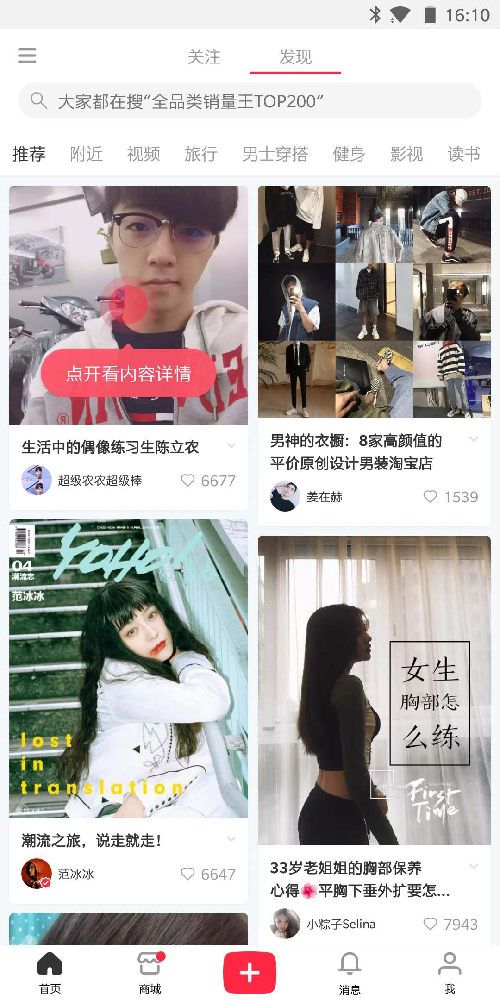
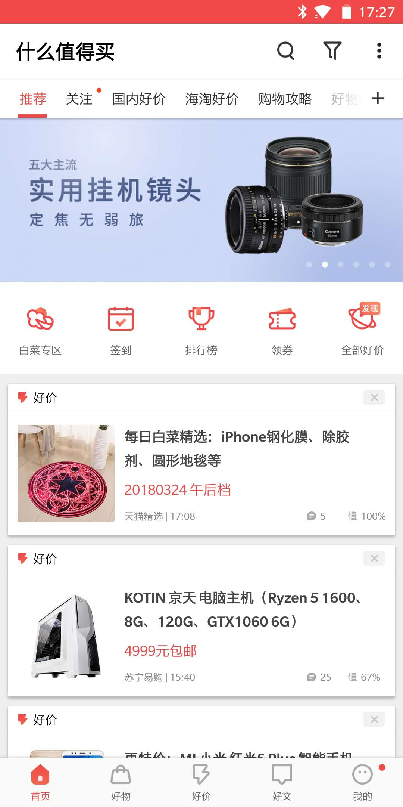
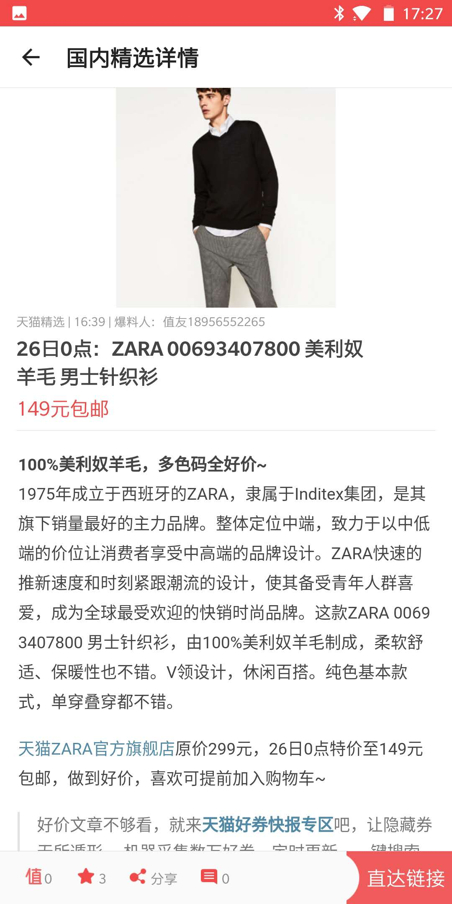
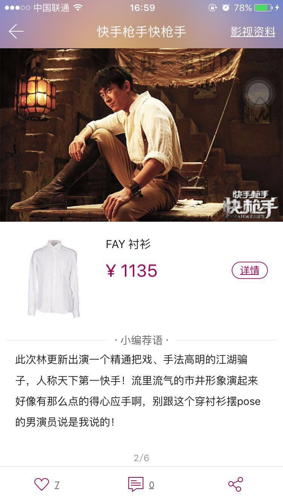

# Starpick 项目前期调研

by 刘博    2018/3/24

## 相关产品与发展综述

​	我们想要开发的产品是 Starpick，提供明星街拍同款相关信息，属于一款细分兴趣领域的 O2O 应用。

​	近年来随着移动互联网的发展，O2O（在线上获取信息，完成支付，再到线下去消费体验） 已经成为我们生活方式的一部分。

​	而相关的服务与平台也是层出不穷，从淘宝京东等老牌综合类电商平台，到更细化的生活服务（外卖，鲜果等），更别提各种小型的兴趣垂直类领域（音乐，健身等）。近两年，相关的平台重心，也从早期的单纯网络营销，慢慢的转向社区打造与内容运营。用内容与社区留住消费者，从重量变为重质。

​	具体的实例有很多，比如各类微信公众号和微信小程序，比如淘宝花重金聘请老年淘宝体验师等，都能体现出这种转变。

## 值得关注的竞争产品（3~5个），及其竞争优势

- 综合类垂直社区，比如：[小红书](http://www.xiaohongshu.com/)，[什么值得买](https://www.smzdm.com/)

  优势：内容质量高，用户参与度高，粘性大

- 主打相关内容的微信公众号，[淘宝相关资讯页面](http://m.tb.cn/h.WvwfDY0)

  优势：依附于大平台，资源众多，比如推广传播等

- 其他小众平台或综合资讯网站，如[大花猫同款](http://www.dafamao.com/star/)

  优势：直接和商家合作导流，有良好的盈利模式

- 微博，Twitter，Instagram 等社交平台的讨论

  优势：有广泛的用户基础和强大的传播能力

## 相关产品的市场（客户）定位

主要分为两大方向：

1. 直接和商家合作，提供直达商品链接，该类产品以服务商家为主，偏向传统的广告营销，面对对象为潜在的该类产品消费者
2. 以运营平台和内容为主，增强用户粘性，这类产品客户定位面十分广泛，只要以内容感兴趣的用户都是其目标对象。

## 某个产品的典型业务实现的过程，核心界面

- **小红书**： 以综合信息为主，比如评测，教程等

  1. 展示页：

     图片流式展示，以图片为主，辅以简单标题，作者和点赞数信息

  2. 详情页：

     图片 + 文字介绍 + 留言 + 功能选项

- **什么值得买**：

  1. 主页：

  2. 详情页：

- **影觅**：

  详情页：

  图片 + 商品信息 + 文字介绍 + 功能选项
  

## 可能存在的新机遇

1. 大数据，能根据我们的兴趣和浏览记录构建用户画像，推荐我们喜欢的东西，这项技术目前已经仍处于高速发展期，并且和人工智能也有很多应用的结合。

2. 实时渲染交互技术，最近的 GDC 大会上，实时渲染合成的数字人类 Siren 已经展示了这种技术的实现可能，也许在几年后，这种技术便能变革我们的 O2O 体验。

   比如，以本项目为例，现在只能查看高清图片来想象商品的细节，利用该技术，也许可以 AR，VR 的方式，体验和摆弄心仪的产品，甚至一键试穿试用到足以乱真的自身的虚拟人物上。

