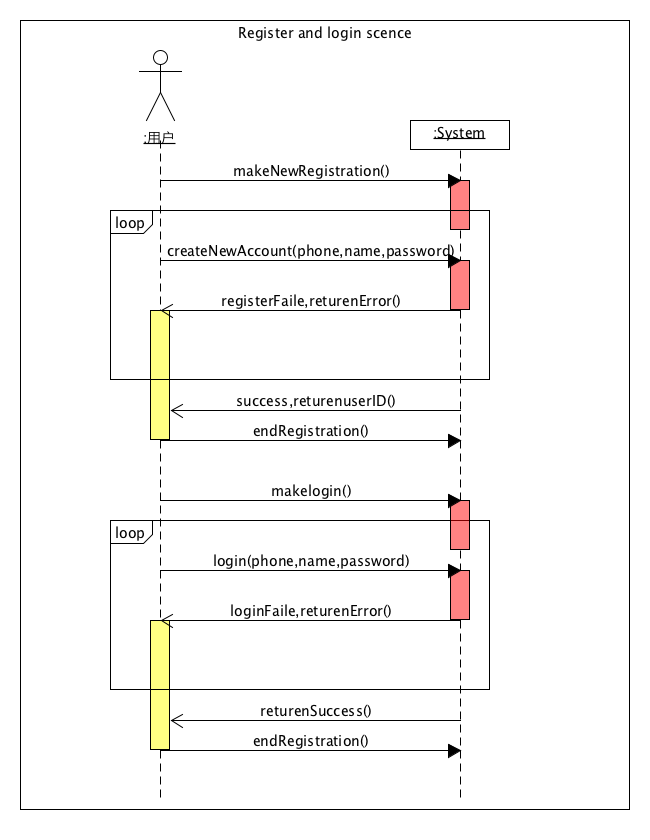
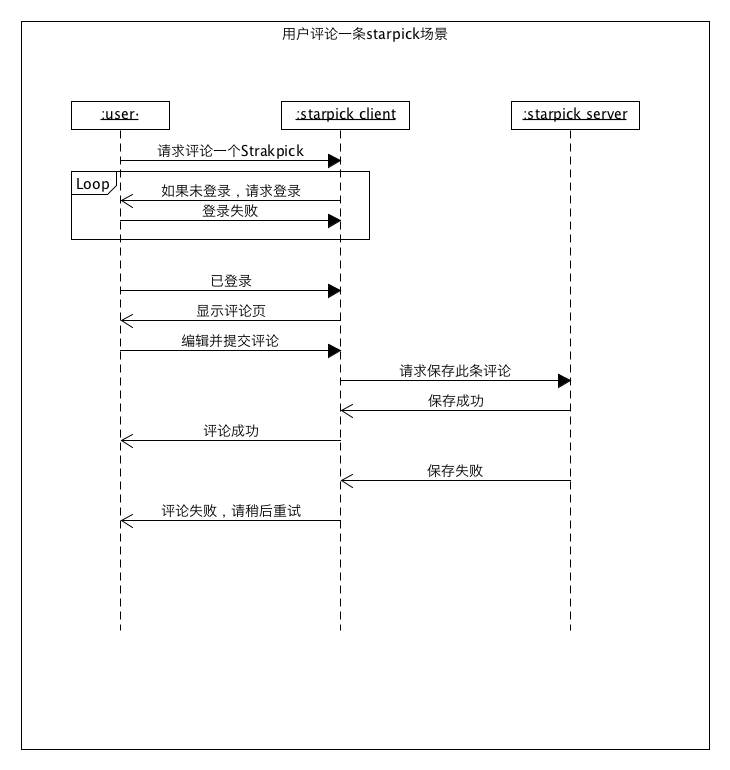
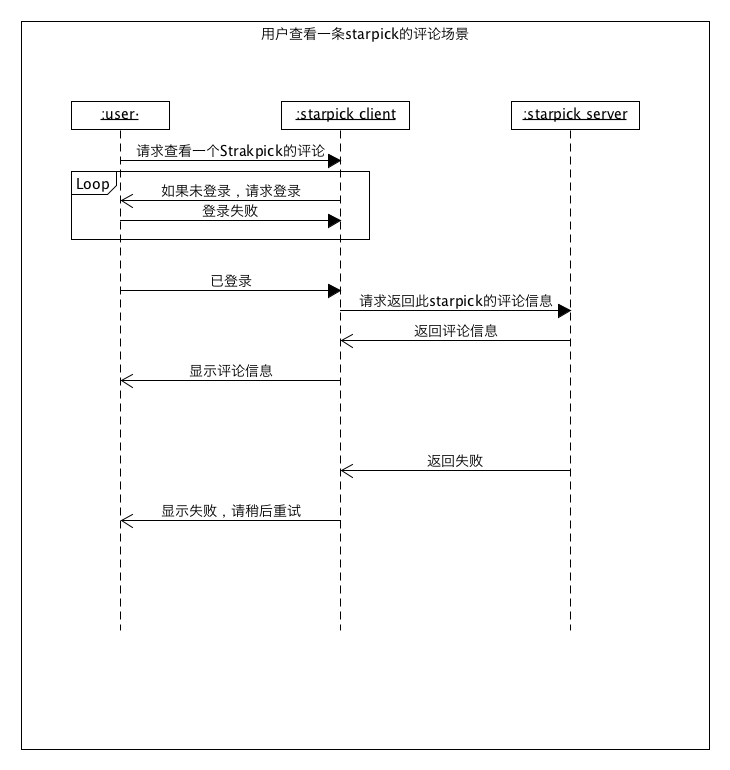

# 6.5 System Sequence Diagram（功能模型）
## 用例主场景一：注册/登陆
by 15331356 Joyce

## 用例主场景二：发布图片/starpick
by 15331356 Joyce

## 用例主场景三：修改用户个人信息  
by 15331341 Loneop  

## 用例主场景四：用户评论一条star pick
by 15331345 Angfu     
 

## 用例主场景五：用户查看一条star pick的评论
by 15331345 Angfu     

