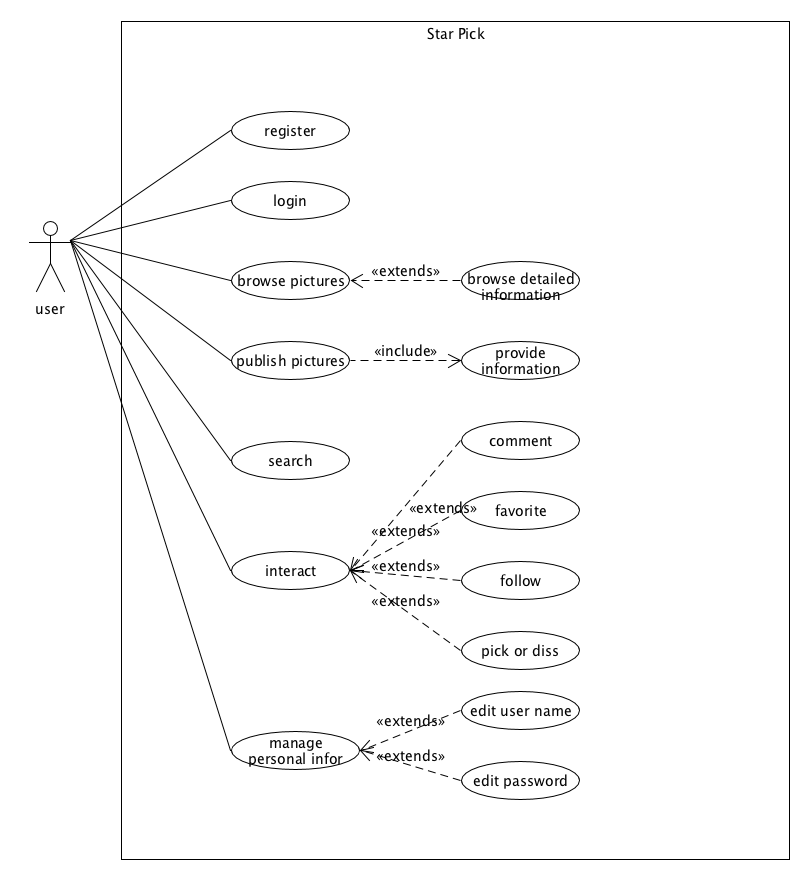
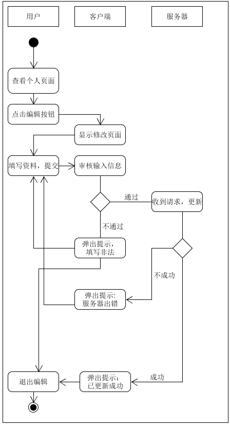
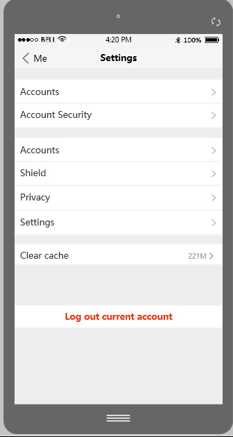
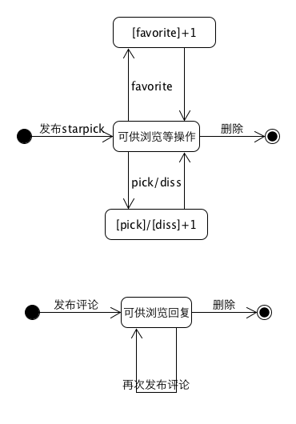
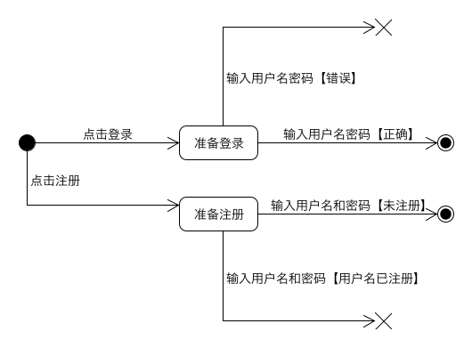

# Requirement specification（需求规格说明）
## 1. Usecase Diagram（用例图）

## 2. Use Cases（用例+活动图）
### 1. Brief Level
* **注册register**：用户点击注册按钮进入注册页面，输入用户名、手机号和登录密码，在确认该手机号未注册过，并且用户名和密码符合要求后，可以弹窗提示用户注册成功并且自动跳转到首页。已注册用户可以点击该页的已有账号进入登录页面进行登录。
* **登录login**：用户点击登录按钮进入登录页面，输入手机号和密码并点击登录，在验证后跳转到首页。未注册用户可以点击该页的需要账号进入注册页面进行注册。
* **浏览图片browse pictures/starpick**：在首页，用户可以浏览已关注用户(follow)的已发布图片、图片的简介(以发布用户的评论显示该图片对应的明星、服装品牌、服装风格等信息的形式呈现)及其他用户的评价，可以点击图片上的标签tag，查看tag对应的服饰的详情(跳转到图片/服饰详情页面)。如果是新用户会有推荐用户的发布图片。
* **发布图片publish pictures/starpick**：用户可以点击“加号”(新建)按钮，跳转到新建图片页面，上传图片并填写必要的信息、添加tag后发布图片。
* **搜索search**：用户可以在搜索框输入用户名搜索用户或输入明星的名字、服装风格、服装品牌等关键字搜索图片。

### 2. Casual Level
* 管理个人信息
	* 主成功场景：用户进入个人信息页面，可查看个人信息，可点击编辑按钮进入编辑页面，修改个人用户名、个人密码；如果输入信息符合检验要求，则可点击提交按钮，服务器同时根据请求对数据库进行更新，并返回确认信息，客户端弹出修改成功的确认信息。
	* 交替场景 ： 如果服务器出错，弹出相应的提示。
	* 活动图
	
		

	* UI界面： 
	
		

### 3. Fully Level
**interact**交流互动

*	**范围**：网页图片服装信息交流
*  **级别**：用户目标
*  **主要参与者**：用户
*  **涉众及其关注点**
	* 发起互动者：希望能将自己评论的话准确地显示在被评论者发出的star pick的评论栏中，并能通知被评论者，使其即时看到；收藏的star pick会保存在自己的收藏页面中；关注用户可以将其信息保存在自己的关注页面中；可以pick或者diss某条star pick。
	* 收到互动者：希望自己即时看到别的用户对自己某条star pick的评论，能够回复对方的评论，以及看到自己的每条star pick被pick或者diss的次数
	* 第三方用户（即不是发起评论的用户也不是接受评论的用户）：可以看到上其他两方之间的评论，自己也可以参与评论，能够看到其他用户的star pick被pick或者diss的次数。
*  **前置条件**：用户需登录
*  **成功保证**：成功保证：用户的评论、收藏操作都与用户的账号绑定；用户受到的评论、pick、diss与用户发送的图片绑定
*  **主成功场景**
	* 用户登录
	* 用户浏览图片
	* 用户收藏图片
	* 用户在图片下发送评论
	* 用户对图片进行踩、赞操作
*  **扩展**
	* 当用户收藏、评论的图片被删除时，该收藏、评论内容失效
	* 用户注销账户时，评论内容保留，相关的用户账户改为“已注销“
	* 用户浏览所有已收藏图片
*  **发生频率** 可能会不断地发生。	
*  UI原型    
	
	
## 3. Domian Model（领域模型）
## 4. State Model（状态模型）
# State Model

## Starpick and Comment State Model

## Log on and Register State Model

