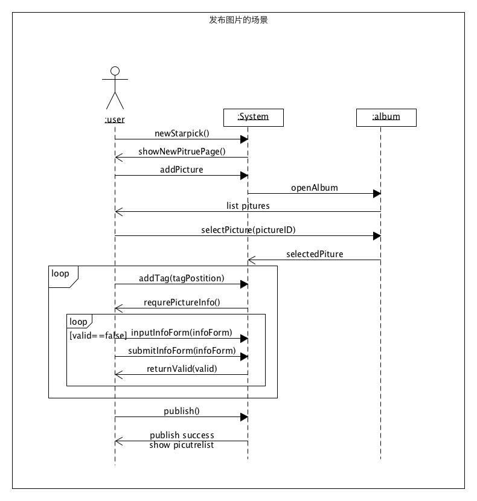

# Requirement specification（需求规格说明）
## 1. Usecase Diagram（用例图）

## 2. Use Cases（用例+活动图）
### 1. Brief Level
* **注册register**：用户点击注册按钮进入注册页面，输入用户名、手机号和登录密码，在确认该手机号未注册过，并且用户名和密码符合要求后，可以弹窗提示用户注册成功并且自动跳转到首页。已注册用户可以点击该页的已有账号进入登录页面进行登录。
* **登录login**：用户点击登录按钮进入登录页面，输入手机号和密码并点击登录，在验证后跳转到首页。未注册用户可以点击该页的需要账号进入注册页面进行注册。
* **浏览图片browse pictures/starpick**：在首页，用户可以浏览已关注用户(follow)的已发布图片、图片的简介(以发布用户的评论显示该图片对应的明星、服装品牌、服装风格等信息的形式呈现)及其他用户的评价，可以点击图片上的标签tag，查看tag对应的服饰的详情(跳转到图片/服饰详情页面)。如果是新用户会有推荐用户的发布图片。
* **发布图片publish pictures/starpick**：用户可以点击“加号”(新建)按钮，跳转到新建图片页面，上传图片并填写必要的信息、添加tag后发布图片。
* **搜索search**：用户可以在搜索框输入用户名搜索用户或输入明星的名字、服装风格、服装品牌等关键字搜索图片。

### 2. Casual Level
* 管理个人信息
	* 主成功场景：用户进入个人信息页面，可查看个人信息，可点击编辑按钮进入编辑页面，修改个人用户名、个人密码；如果输入信息符合检验要求，则可点击提交按钮，服务器同时根据请求对数据库进行更新，并返回确认信息，客户端弹出修改成功的确认信息。
	* 交替场景 ： 如果服务器出错，弹出相应的提示。
	* 活动图
	
		

	* UI界面： 
	
		

### 3. Fully Level
**interact**交流互动

*	**范围**：网页图片服装信息交流
*  **级别**：用户目标
*  **主要参与者**：用户
*  **涉众及其关注点**
	* 发起互动者：希望能将自己评论的话准确地显示在被评论者发出的star pick的评论栏中，并能通知被评论者，使其即时看到；收藏的star pick会保存在自己的收藏页面中；关注用户可以将其信息保存在自己的关注页面中；可以pick或者diss某条star pick。
	* 收到互动者：希望自己即时看到别的用户对自己某条star pick的评论，能够回复对方的评论，以及看到自己的每条star pick被pick或者diss的次数
	* 第三方用户（即不是发起评论的用户也不是接受评论的用户）：可以看到上其他两方之间的评论，自己也可以参与评论，能够看到其他用户的star pick被pick或者diss的次数。
*  **前置条件**：用户需登录
*  **成功保证**：成功保证：用户的评论、收藏操作都与用户的账号绑定；用户受到的评论、pick、diss与用户发送的图片绑定
*  **主成功场景**
	* 用户登录
	* 用户浏览图片
	* 用户收藏图片
	* 用户在图片下发送评论
	* 用户对图片进行踩、赞操作
*  **扩展**
	* 当用户收藏、评论的图片被删除时，该收藏、评论内容失效
	* 用户注销账户时，评论内容保留，相关的用户账户改为“已注销“
	* 用户浏览所有已收藏图片
*  **发生频率** 可能会不断地发生。	
*  UI原型    
	
	
## 3. Domian Model（领域模型）
对 6.2 的正式或非正式用例建立 domain model

业务对象：user，pictures, comments, idol, clothes(tag)

## 4. State Model（状态模型）

### Starpick and Comment State Model

### Log on and Register State Model

## 5. System Sequence Diagram（功能模型）
### 用例主场景一：注册/登陆
by 15331356 Joyce

### 用例主场景二：发布图片/starpick
by 15331356 Joyce

### 用例主场景三：修改用户个人信息  
by 15331341 Loneop  

### 用例主场景四：用户评论一条star pick
by 15331345 Angfu     
 

### 用例主场景五：用户查看一条star pick的评论
by 15331345 Angfu     

## 6.6 Supplementary Requirements（补充需求）
 
### 简介
本文档记录了所有未在用例中描述的需求。

### 功能性
1. 日志和错误处理  
 
	在持久性存储中记录所有错误

2. 安全性  

	任何使用都需要经过用户认证

### 可用性
人性因素

发布信息是我们app的主要功能，所以放在用户进入app第一眼就能看到的位置，而且本系统的使用者基本上不希望在自己的计算机上特别安装客户端软件，因此本系统的表现方式将采用Web的形式。
 
### 可靠性
1. 可恢复性  
	如果在使用app发布信息时遇到错误，为了保存信息以便再次发布，需要在本地存储。

2. 性能   
	用户需要很快的得到各种PickStar的信息。

### 可支持性
1. 可适应性 
  
	app适合各种年龄段追求明星同款的的用户，一部分是喜欢分享的用户，一部分是更喜欢去浏览获得明星同款信息的用户。

2. 可配置性  
 
	可以增加一些用户自定义的元素，如用户头像，用户主页背景等。

### 实现约束
* 所选取的程序设计语言：python， vue框架
 
### 购买构件
* 无
 
### 免费开源构件
1. 尽可能使用一些免费的开源构件
2. 尽量采用Struts作为MVC模式的编程框架。
3. 如果条件允许（技术条件），则采用Hibernate作为应用系统的持久层的框架。
 
### 接口
1. 重要的硬件接口
   
   PC机

2. 软件接口：

   储存信息服务器的接口

### 应用的领域（业务）规则

<table>
    <thead>
        <tr>
            <th>ID</th>
            <th>规则</th>
            <th>可变性</th>
            <th>来源</th>
        </tr>
    </thead>
    <tbody>
       <tr>
            <th>规则1</th>
            <th>新注册的用户可以为其推荐一些老用户的piackstar供其浏览并follow</th>
            <th>选那些老用户的pickstar可根据实际情况确定和改变</th>
            <th>网站政策</th>
       </tr>
       <tr>
            <th>规则2</th>
            <th>同一用户不能在相近的时间里发布相同的pickstar，避免恶意攻击</th>
            <th>相邻多长时间可以是情况规定</th>
            <th>网站政策</th>
        </tr>     
    </tbody>
</table>

