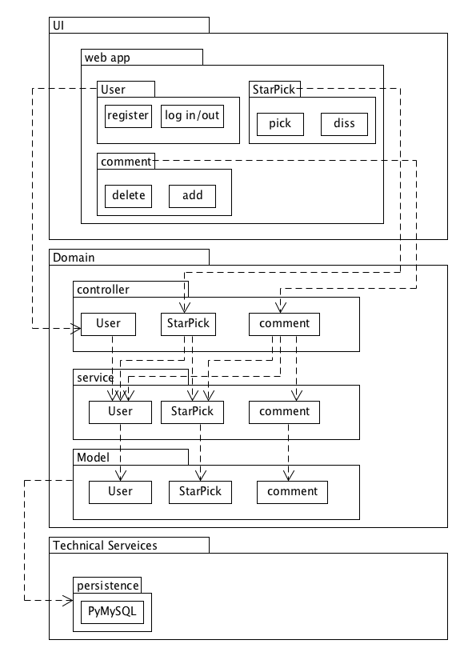

# 7.4 Software Architecture Document

## 架构问题

### 可靠性
在web app使用过程中出现访问服务端中断问题并进行恢复，在正常的工作环境下，如果在15s内检测到其恢复，则重新建立连接，在能够重新建立连接之前，可以在客户端进行简化服务，使用者的访问数据可能会发生丢失，无法传递给服务端。

## 解决方案说明

### 提高服务器性能
* 增加服务器内存
* 限制同时服务的最多用户数，避免服务器负载超荷
* 将动态数据存储到缓存文件中，前端直接调用这些文件，而不必再访问数据库
* 优化数据库的查询SQL，避免使用代价高昂的查询，每次查询只返回自己需要的结果；避免短时间内的大量SQL查询
* 数据库适当建立索引
* 数据库定期备份，当数据库出现操作失误或系统故障导致数据丢失时可以恢复数据

## 逻辑视图

## 物理视图