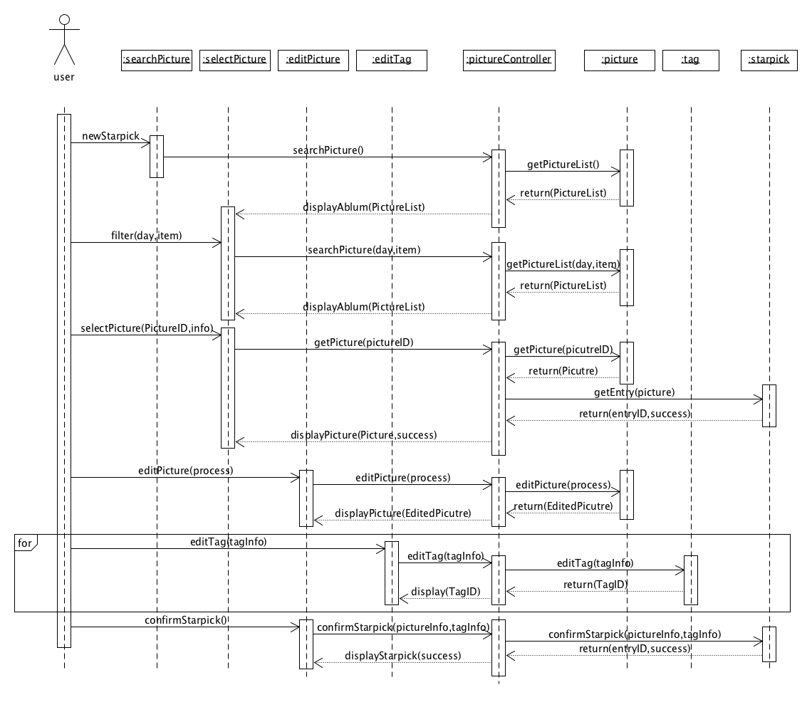
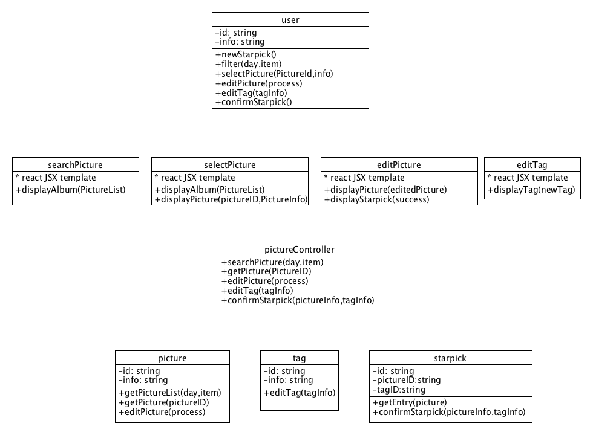

# 7.5 Usecase design
## 选取用例

[项目用例图](https://starpick.github.io/dashboard/6.1_Usecase%20Diagram)

选取其中单个用例

* 上传starpick
	
	
	

## 识别出来的BEC类别

* Boundary
	* searchPicture：用于显示相册图片的界面
	* selectPicture：用于显示选择的图片的界面
	* editPicture：用于显示编辑的图片及图片信息、tag信息的界面
	* editTag: 用于显示添加的tag的详情与编辑界面
* Controller
	* pictureController:负责处理boundary与外部的交互，实现控制流
* Entity
	* user：用户本身
	* starpick：图片与tag(类似一条微博)
	* picture：图片
	* tag：标签信息

## BCE的顺序图

## BCE的类图

