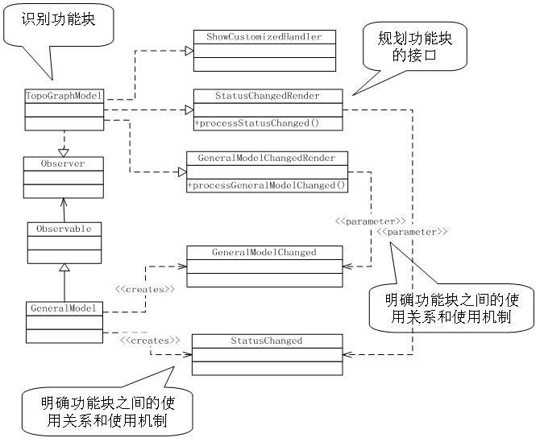

# 8.3 逻辑架构到应用程序映射指南

## 逻辑架构

软件的逻辑架构规定了软件系统由哪些逻辑元素组成、以及这些逻辑元素之间的关系。

软件的逻辑元素一般指某种级别的功能模块，大到我们熟悉的逻辑层（Layer），以及子系统、模块，小到一个个的类。至于具体要分解到何种大小的功能模块才可结束软件架构设计，并不存在一个“一刀切”的标准——只要足够明确简单，能够分头开发就可以了。于是，在实践中我们往往将关键机制相关的架构设计部分明确到类，而一般功能则到模块甚至子系统的接口定义即可。

值得说明的是，功能模块有时容易识别，有时却比较隐含。而比较全面地识别功能块、规划功能块的接口、明确功能块之间的使用关系和使用机制，正是软件逻辑架构设计的核心任务所在。

上图展示了一个网络设备管理系统逻辑架构设计的一部分，我们借此来举例说明软件逻辑架构设计的3大核心任务：

* 识别功能块

* 规划功能块的接口

* 明确功能块之间的使用关系和使用机制

软件的逻辑架构是架构设计思维的重要方法。在用例技术已经成为捕获功能需求的事实标准的今天，逻辑架构的设计往往是从用例分析开始的。基于用例的分析方法使逻辑架构的设计变得比较有序——通过对每个关键用例的分析，从逻辑上将用例实现为一组功能块的特定组合，最后综合这些用例分析成果，将一个个独立的协作归纳合并成整个软件系统的逻辑架构。而在用例分析方法产生之前，功能模块的确定多多少少带有些“硬”想出来的味道，特别是并不直接承载业务功能的模块有时比较容易遗漏，直到大规模编程实现阶段才发现。

## BCE模式（Boundary-Control-Entity Patterns）

* 序列图关联了类图和用例图两方面，可通过BCE模式来确定序列图。

* 使用BCE模式可以降低绘制用例序列图的难度。

* 将对象分为三类：边界类、控制类、实体类 

	* 边界类：用来隔离系统，通常负责接收并响应系统内外的消息。参与者只能与边界对象互动，不能直接发送消息给控制对象或实体对象。

	* 控制类：对应用例，控制用例执行期间的复杂运算或者业务逻辑。

		* Boundary发生的用户事件消息，皆是controller的方法。

	* 实体类：从类图来看，我们找出对应领域概念的类，正属于实体类，用来保存问题领域的重要信息，封装了跟数据结构和数据存储有关的变化。 
	   * 从领域模型获取属性
	   
	   * 如果模型之间存在关联，请将关系转为合适的实现
	   
	   * 将controller消息转化为方法
* 应用原则： 

   * 针对每一个用例，可以对应生成一个控制类。

   * 参与者对象只能跟边界对象互动。
   
   * 实体对象不能发送消息给边界对象和控制对象。
   
   * 如果只是单纯对数据表进行增加、删除、修改、查询的话，可以不设置控制对象，让边界对象直接发送消息给实体对象，以提高整个序列图的执行速度。