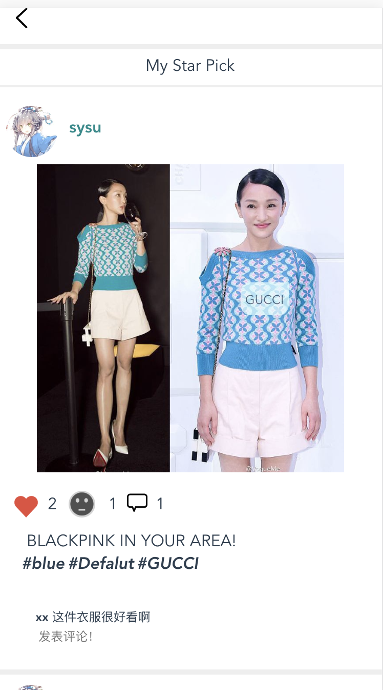

# 用户手册
## 1.引言
### 1.1编写目的
本文档编写的目的是充分叙述本软件所能实现的的功能及其运行环境，以便使用者了解本软件的使用范围和使用方法，并为软件的接下来的开发提供必要的信息
### 1.2项目背景
开发软件名称：StarPick(星选）    
开发者：Raybo, Yan, Loneop, Xue, Joyce    
用户：任何使用此软件的人
## 2.项目概述
### 2.1目标
StarPick，是一款由用户上传明星穿搭，标注服装信息的移动端Web APP。为用户提供整合明星图片喝相关服装信息的一键发布平台，营造一个分享明星同款穿搭的信息交流社区。
### 2.2 软件运行
本软件可以运行在Web上

### 2.3 安装部署配置

参照文档[安装部署说明]()进行相应操作

### 2.4 软件使用过程
1. 用户注册账号并登录
   
   
   
2. 进入home页面，有搜索，查看排行榜功能，因为刚注册还没有关注的用户，所以没有starpick显示

   
   
3. 个人主页，可以查看自己发的Starpick，以及关注的用户，和被谁关注

   
   
   

4. 点击上方的`+`，可以发一条StarPick，点击相册按钮，现在暂时只能提供图片链接来上传图片

   
   
   
5. 上传图片之后就可以编辑图片的信息了，为图片加上Tag，填写一些图片说明

   
   

6. 编辑完成之后就可以发布starPick了

   

7. 发布之后，可以在首页看到自己发布的StarPick，自己和别的用户都可以对StarPick进行评论以及点赞或者diss.

   
   
8. 要关注其他用户怎么办呢，就需要用到搜索功能，在搜索框输入自己感兴趣的内容，查看是否有关于此内容的StarPick。比如搜索zx，找到了一条StarPick， 就可以点击用户名，进入这个用户的主页，进行关注
   
   
   
   
   
   关注之后就可以在主页看到这个用户的发布的StarPick了
   