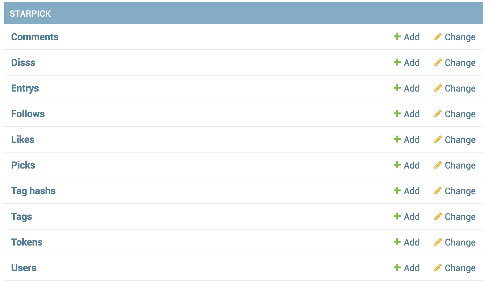

# 软件设计文档
## Part1:概述
说明：该项目为本学期系统分析与设计的课程作业，综合实训小组成员与该课程的小组成员相同，所有代码和文档均为原创。

### 1.1 项目框架选择
starpick是基于移动端的web应用，该项目涉及到前端和后端开发，在实现中，我们采取了**前后端分离**以便更好的进行分工开发和维护。

* 整个项目使用 PostgreSQL作为数据库存储结构化数据
* 用基于MVC框架的Django搭建后端http服务器，用于提供RESTful接口服务
* 前端使用基于MVVM框架的VueJS
* 前端集中于前端开发工作，而不需要考虑API接口是怎么实现的；同时后端也只需要提供好API接口，而不需要考虑前端的工作

### 1.2 项目部署图：


根据上图所示的部署图，我们的实现划分为前端和后端（服务端），由小组内的前端工程师和后端工程师分别同时进行开发。接下来分别对前端和后端的技术选型及理由、架构设计和模块划分。

## Part2:前端Font-End
前端代码：[clientcode](https://github.com/starpick/clientcode)
### 2.1 技术选型及理由
前端采用的技术栈为：webpack+vue+vue-router+vuex

* webpack:项目构建打包
* vue：一个基于MVVM的用于构建用户界面的渐进式JavaScript框架
	* vue-router:单页应用前端路由
	* vuex:应用数据状态管理
	
理由：

* **webpack**是当下前端最流行的构建打包工具，利用 webpack 搭配相应的 loader，我们可以在前端项目中使用 es6 进行开发，效率更高。开发完成后，webpack 还可以帮我们完成构建，将代码编译到 es5 以兼容大部分浏览器。**所以我们选择webpack有效的提高开发的效率，专注于功能的实现而不需要考虑编译兼容等问题。**
* **vue**是当下前端开发中的前沿技术框架，Vue 的核心库只关注视图层，它不仅易于上手，还便于与第三方库或既有项目整合。另一方面，当与单文件组件和 Vue 生态系统支持的库结合使用时，Vue 也完全能够为复杂的单页应用程序提供驱动。Vue使用声明式渲染，使用简洁的模版语法，同时Vue支持组件化应用构建，**便于前端的成员分别进行组件开发，能够很好的满足我们项目的web应用的需求以及团队开发的合理分工。**
* **vue-router**能够简单地实现将组件映射到路由，在组件中使用this.$router实现页面的跳转。
* **vuex**是类Flux的状态管理，通过vuex的store模式可以中多个组件中对一个实例的state进行读取、修改，可以有效简洁的进行我们项目中的用户状态管理。

### 2.2 架构设计
前端项目主要涉及应用界面和业务逻辑开发以及产品构建，同时还要提供配置项用于配置构建打包的目标路径以及代理服务器的地址等信息。根据需要确定项目需要有以下4个包:

* build：运行提供开发环境和构建项目的代码
* config：项目的webpack打包配置、http代理配置
* src：项目的源代码，主要都在src里面进行开发
* dist：项目构建后的产品文件

无论是开发或者构建，都需要依赖到config里面的配置和src里面的源码。本项目使用webpack进行打包，build里面的代码会根据config的配置来调整webpack的打包规则，例如是否开启gzip、构建产品目标路径、HTTP代理规则等。调整好配置之后会将src里面的源码进行打包，如果是构建的话，由于config里面进行了设置，最终的产品文件都会存放到dist里面。

构建开发环境后，在src中实现具体的功能，需要设计src的具体结构，在components中实现具体的组件，在router中实现路由的界面跳转，在store中实现状态管理。

* comments：所有组件——vue技术
* router：路由设置——vue-router技术
* store：应用数据状态——vuex技术


### 2.3 模块划分
根据原型设计的交互逻辑图，将项目分为7个模块。

（其中entry指一个starpcik，包括图片、标签、描述以及标签链接）


* **首页模块**：首页由于是主界面且涉及到各个页面的交互，所以单独划分为一个模块
* **登陆注册模块**：登陆注册的操作相似，都需要提供个人信息，实际实现使用同一页面在弹窗显示登陆和注册，作为一个模块
* **排行模块**：由于排行榜涉及的对entry的pick数目统计排序，与其他页面没有交互，单独设为一个模块
* **发布模块**：发布模块主要是用户发布新的entry，包括上传图片、编辑entry信息、标签详情，由于图片标签详情页面与发布时填写的标签详情相关，所以将图片标签详情放到一个模块
* **entry交互模块**：每个entry具有的交互功能pick、diss、评论作为一个模块
* **用户管理模块**：通过点击用户名可以跳转到用户详情页面，对用户管理区分为登陆用户和其他用户，登陆用户自己的用户详情页面可以跳转到设置页面，所有用户都可以跳转到查看用户的发布的entry页面、关注者页面和粉丝页面
* **搜索模块**：通过标签链接的内容进行查询，可以在搜索框中输入进行查询，也可以直接点击标签链接查询具有相同标签内容的entry

```
├─build：存放构建用到的相关文件
├─config：存放配置文件
├─static：存放前端静态资源
├─src：前端开发的源码
├── components
│   ├── .DS_Store
│   ├── HomePage.vue首页
│   ├── LoginPage.vue登陆注册页面
│   ├── Me.vue用户详情页面
│   ├── MyFollow.vue用户关注者页面
│   ├── MyFollower.vue用户粉丝页面
│   ├── MyStarpick.vue用户发布的entry页面
│   ├── PickEntryDetail.vue图片标签详情页面
│   ├── PickRanking.vue排行榜页面
│   ├── Setting.vue设置页面
│   ├── TagSearch.vue标签搜索页面
│   ├── UploadFromAlbum.vue通过相册上传图片页面
│   ├── UploadFromCam.vue通过相机拍摄上传图片页面
│   ├── UploadInfo.vue填写上传entry信息页面
│   ├── UploadPage.vue上传的方式选择页面
│   └── UploadShare.vue返回上传结果页面
├── main.js
├── App.vue
├── router
│   ├── .DS_Store
│   └── index.js
└── store
    └── index.js

```
按不同的模块进行分工，由不同的小组成员完成。

## Part3:后端
后端代码：[server code](https://github.com/starpick/serverCode)
### 3.1 技术选型及理由

后端即服务端采用的技术栈为：python Django+PostgreSQL

理由：

* **python Django**是一个MVC web框架，由于使用python语言，具有配置管理( SaltStack、Ansible )
，数据分析( Pandas )，任务队列( Celery )，Restful API( Django REST framework )，HTTP请求( requests )，再加上高度抽象的ORM，功能强大的 Query Expressions，简单清晰的配置，着重提一下堪称神器的自带App: Admin，有了它再也不用将一些经常变化的配置写在文件里面，每次增删改都重新发布一次，只需要定义出配置的 data scheme ，只需要几行代码，Django Admin便为你提供美观，并带有权限控制的增删改查界面，而且可以通过ORM为它生成的API来做到定制化的更新。**对于我们没有后端开发经验的小组可以用python很快学习服务端开发。**

* **PostgreSQL**是一个自由的对象-关系数据库服务器(数据库管理系统)，它在灵活的 BSD-风格许可证下发行。具有稳定性极强，性能高速度快的优点。

### 3.2 架构设计
服务端主要进行数据管理及API的开发，按照数据库模型和用例设计进行了开发。
完整的数据库模型为：


使用Django administration，开启服务后进入http://127.0.0.1:8000/admin/，可以查看管理数据库。



### 3.3 模块划分
服务端的目录结构为：

```
.
├── .DS_Store
├── .git
├── .gitignore
├── README.md
├── db.sqlite3
├── manage.py
├── mysite
│   ├── __init__.py
│   ├── __pycache__
│   ├── settings.py
│   ├── urls.py
│   └── wsgi.py
└── starpick
    ├── __init__.py
    ├── __pycache__
    ├── admin.py
    ├── apps.py
    ├── handlers
    │   ├── AuthenticationHandler.py
    │   ├── DissHandler.py
    │   ├── __init__.py
    │   ├── __pycache__
    │   ├── commentHandler.py
    │   ├── editEntry.py
    │   ├── followHandler.py
    │   ├── handlerHelp.py
    │   ├── likeHandler.py
    │   ├── sendEntryHandler.py
    │   ├── tagHash.py
    │   ├── uploadEntryHandler.py
    │   └── userHandler.py
    ├── migrations
    │   ├── 0001_initial.py
    │   ├── 0002_auto_20180516_0235.py
    │   ├── 0003_auto_20180516_0241.py
    │   ├── 0004_auto_20180516_0306.py
    │   ├── 0005_auto_20180524_1113.py
    │   ├── 0006_auto_20180530_0355.py
    │   ├── 0007_entry_likenumber.py
    │   ├── 0008_comment.py
    │   ├── 0009_entry_commentnumber.py
    │   ├── 0010_auto_20180626_1146.py
    │   ├── 0011_auto_20180629_0206.py
    │   ├── __init__.py
    │   └── __pycache__
    ├── models.py
    ├── tests.py
    ├── urls.py
    └── views.py
```
