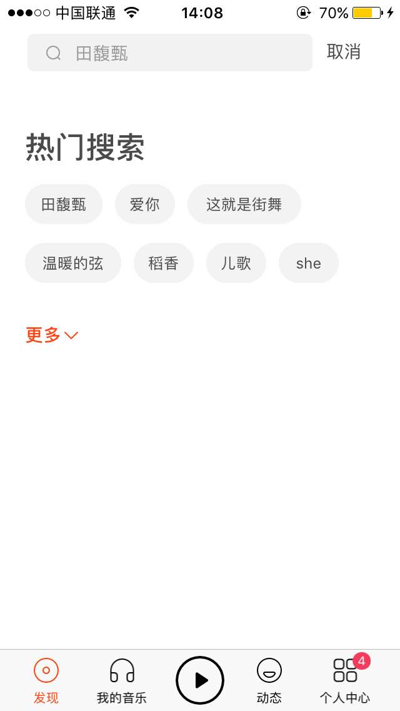

# 建模练习
## 文档编写

选择移动APP的某个业务：虾米音乐搜索并添加歌曲到歌单的业务

*Screenshot 1*

*Screenshot 1* 首页，要求用户user在搜索栏输入歌曲关联词，比如歌曲名字，歌唱者名字等。搜索按钮允许向系统提交请求，在搜索结果中显示与关联词相关的结果。

*Screenshot 2*

*Screenshot 2* 显示了点击搜索栏的界面，用户可以输入想要搜索的相关词。

*Screenshot 3*

*Screenshot 3* 显示了搜索结果(正确搜索的结果)界面，默认显示歌曲检索结果，可切换到其他检索结果(专辑，艺人，歌单，mv,用户)。(以检索歌唱者名字为例)

* **你可能感兴趣的结果**：正确检索的结果是歌手的名字及其简介显示在第一个检索结果。
* **已为你找到x首相关歌曲**：显示搜索歌手的歌曲，向下滑动可以查看更多结果。
* 切换检索结果：
	* 专辑：显示歌唱者所演唱的专辑
	* 艺人：显示歌唱者的艺人词条，点击可以查看艺人的详情
	* 歌单：显示含有歌唱者名字的歌曲的歌单
	* MV：显示艺人相关的MV
	* 用户：显示用户名含有所检索关键词的用户 
* 点击任一搜索结果的歌曲右侧的三点可以对歌曲进行添加到歌单操作，如*Screenshot 5*所示。

如果没有相关的结果，则显示**没有搜索到任何内容**，如*Screenshot 4*所示，选择取消则回到*Screenshot
 1*的界面，重新输入关联词则再次搜索。

*Screenshot 4*

*Screenshot 5*

*Screenshot 5* 显示了对所选歌曲可以进行的操作，点击**加到歌单**，自动跳转到*Screenshot 6*。

*Screenshot 6*

*Screenshot 7*

*Screenshot 6* 显示了用户已创建的歌单列表，点击**+新建歌单**，则如*Screenshot 7*所示，要求用户输入歌单名称，或点击已存在的歌单，系统显示添加成功，自动跳转到*Screenshot 3*，完成搜索并添加歌曲到歌单的业务。如果用户没有登陆，则只显示**+新建歌单**按钮，点击则跳转到*Screenshot 8*要求用户登陆。

*Screenshot 8*

*Screenshot 8* 显示用户登陆界面，要求用户输入邮箱或手机号及密码，进行登陆操作，登陆成功则跳转到*Screenshot 6* ，用户可选择目标歌单进行添加。 
